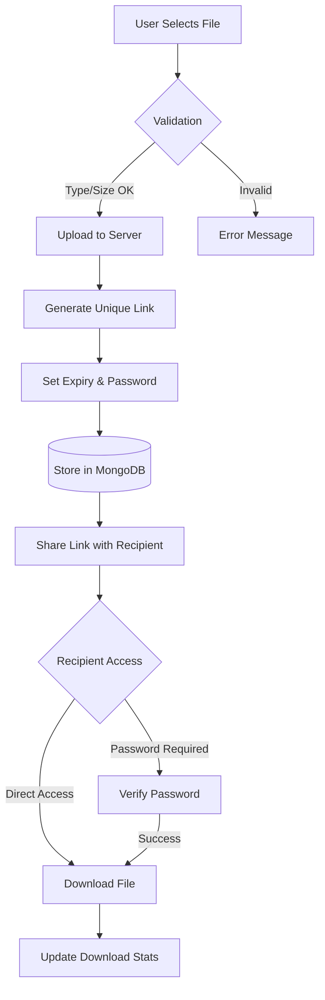

# 📁 Share-IT: Secure File Sharing System


Share-IT is a secure, scalable full-stack web application designed for internal organizational use. It allows users to upload and share files via unique, time-bound, and password-protected links.

---

## 🚀 Key Features
* **Secure Uploads:** Multi-format validation with size limits.
* **Time-Bound Links:** Links automatically expire after a set duration.
* **Shielded Sharing:** Optional AES-encrypted password protection.
* **Admin Control:** Full dashboard to monitor file traffic and manage storage.
* **Auth System:** Secure JWT-based authentication for administrative tasks.

---

## 🌟 Why Share-IT? 
In an era of data breaches, relying on public cloud links or unencrypted email attachments is a risk. Share-IT is necessary because it provides:
1. **Corporate Confidentiality:** Ideal for HR or Legal departments to share sensitive documents (contracts, payroll) that must "vanish" after 24 hours.
2. **Reduced Storage Bloat:** Since links are time-bound, the system automatically encourages a "clean-as-you-go" storage policy, preventing servers from filling up with old files.
3. **Internal Security:** Avoids "Shadow IT" (employees using personal Dropbox/WeTransfer) by providing a controlled, audited internal alternative.
4. **Developer Collaboration:** Securely share .env templates or configuration files across team members with password protection.

---

## 🛠️ Technology Stack
| Frontend | Backend | Database | Tools |
|----------|---------|----------|-------|
|  React.js + Vite |  Node.js |  MongoDB |  Figma |
|  TypeScript |  Express |  Mongoose |  Postman |
|  Axios | Multer |  |  Git /  GitHub |

---

## 🔄 System Flow 


---

## 📂 Project Structure
<table>
<tr>
<th>Directory</th>
<th>Description</th>
</tr>
<tr>
<td>
<details>
<summary><code>📂 backend/</code></summary>
<ul>
<li><code>📂 controllers/</code> - Request handling logic</li>
<li><code>📂 models/</code> - Mongoose schemas (File, User)</li>
<li><code>📂 routes/</code> - API endpoint definitions</li>
<li><code>📂 middleware/</code> - Auth & Multer config</li>
<li><code>📂 uploads/</code> - Physical file storage</li>
<li><code>server.js</code> - Entry point</li>
</ul>
</details>
</td>
<td>Node.js & Express server-side logic</td>
</tr>
<tr>
<td>
<details>
<summary><code>📂 frontend/</code></summary>
<ul>
<li><code>📂 src/components/</code> - Reusable UI elements</li>
<li><code>📂 src/pages/</code> - View components</li>
<li><code>📂 src/services/</code> - API integration</li>
<li><code>vite.config.ts</code> - Build configuration</li>
</ul>
</details>
</td>
<td>React + TypeScript client application</td>
</tr>
</table>

---

## ⚙️ Quick Start
**1. Clone & Install**
```bash
git clone https://github.com/Secure-File-Sharing-System.git
npm install # Run in both /frontend and /backend
```

**2. Configure Environment (`backend/.env`)**
```code snippet
PORT=5000
MONGO_URI=mongodb://localhost:27017/secureFileDB
JWT_SECRET=your_jwt_secret_key
```

**3. Launch**
```bash
# Start Backend
cd backend && npm run dev

# Start Frontend
cd frontend && npm run dev
```

---

## 🤝 Contributions

We welcome contributions from everyone! To keep the project healthy and safe, please refer to the following:

* **Contribution Guidelines:** Learn how to report bugs or submit features in [CONTRIBUTING.md](./CONTRIBUTING.md).
* **Community Standards:** We follow a strict [CODE_OF_CONDUCT.md](./CODE_OF_CONDUCT.md) to ensure a welcoming environment.

---

## ⚖️ License

This project is licensed under the **GNU General Public License v3 (GPLv3)**. This ensures that the code remains free and open-source for everyone. See the [LICENSE](./LICENSE) file for details.

---

## **_Built to provide a secure bridge for data, ensuring privacy remains a right, not a privilege._**
